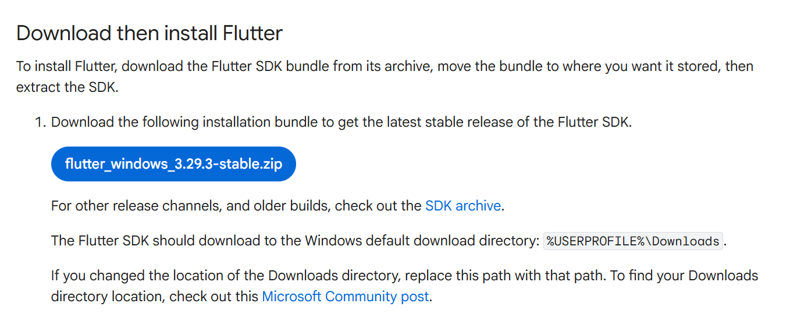
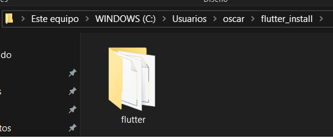
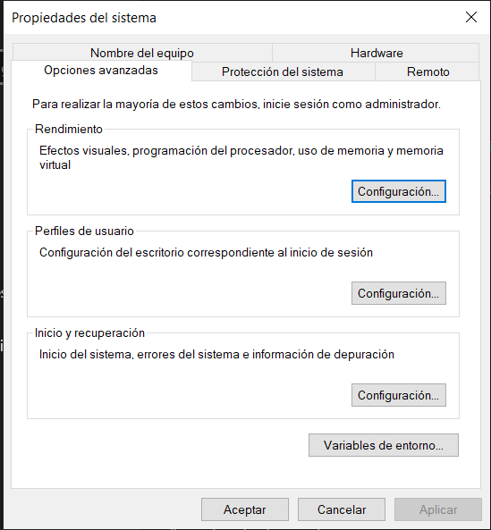
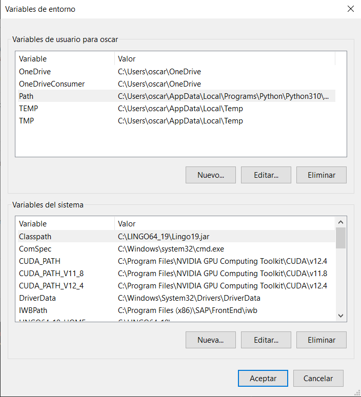
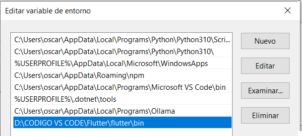
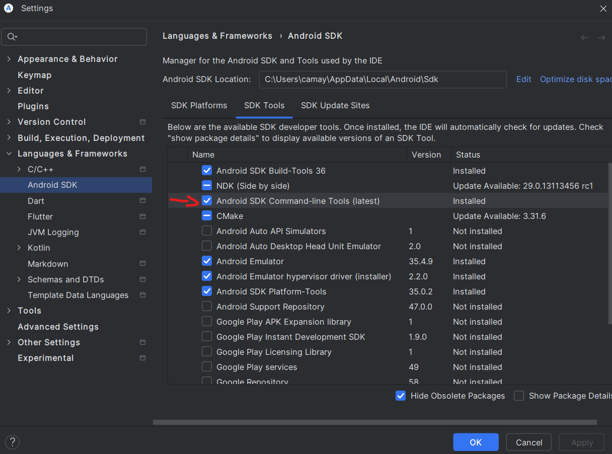
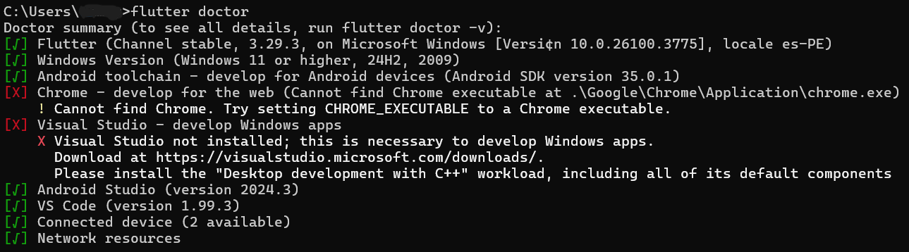
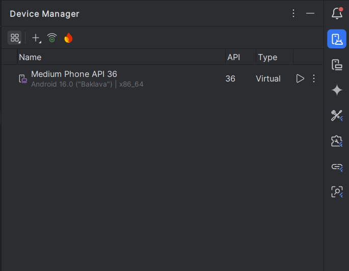
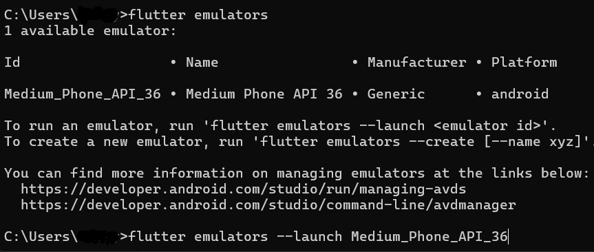

# a. Breve explicación del entorno de desarrollo
### Herramientas requeridas
<ol>
    <li>Flutter</li>
    <li>Visual Studio Code </li>
    <li>Android Studio + Emulador</li>
</ol>

## Instalacion
### **Flutter**

1. **Descargar Flutter SDK**  
   - Ve a [Flutter SDK Releases](https://docs.flutter.dev/get-started/install) y descarga la versión para tu sistema operativo y para el tipo de aplicacion que quieres crear.
        
   - Extrae el archivo ZIP en una ubicación segura donde vas a instalarlo, por ejemplo:  
     ```bash
     C:\Users\{username}\flutter_install
     ```
        

2. **Agregar Flutter al PATH**
   - Entre a la configuracion del sistema usando las teclas **Windows** y **Pause** (o, alternativamente, **Windows** + **Fn** + **B**)
   - Haga click en **"Configuracion avanzada del sistema"**
        
        
   - Haga click en el boton **"Variables de entorno"¨**

        
   - Haga doble click en **"Path"** y añade la ruta a la carpeta `bin` de Flutter, por ejemplo:  
     ```bash
     C:\Users\{username}\flutter_install\flutter\bin
     ```
        


---

### **Android Studio + Emulador**

1. **Descargar Android Studio**
- Ve a la página oficial de [Android Studio](https://developer.android.com/studio) y descarga el instalador para tu sistema operativo.

     

     - Dale click a la opcion de Android SDK
     - Aceptar las licencias en flutter
          ```bash
          flutter doctor --android-licenses
          ```
     - Verificar con "flutter doctor"
          ```bash
          flutter doctor
          ```  
     

2. **Emulador de Android Studio**

     - Abre Android Studio.
     - Ve a **Tools > Device Manager**.
     - Haz click en **Create Device**.
     - Elige un modelo de dispositivo (por ejemplo el Pixel 6).
     - Descarga una imagen del sistema (por ejemplo el Android 13 o 14).
     - Finaliza la configuración y crea el emulador.
     
     

3. **Emulador de Flutter**
- Una vez que tienes el emulador creado puedes abrir el emulador desde la terminal:
  
    ```bash
    flutter emulators --launch "nombre_emulador"
    ```

- Flutter lo detectará automáticamente y podrás correr tu app con el comando:

    ```bash
    flutter run
    ```
     

4. **Instalar tu App Flutter directamente en tu celular físico**

     #### Activar Opciones de Desarrollador en tu Android
     - Ve a **Configuración > Acerca del teléfono**.
     - Toca varias veces en **Número de compilación** hasta que se activen las **Opciones de desarrollador**.

     #### Activar Depuración USB
     - Entra a **Opciones de desarrollador** y activa **Depuración por USB**.

     #### Conectar el celular a la PC
     - Usa un cable USB y selecciona **Modo de transferencia de archivos (MTP)** si te pregunta.

     #### Permitir la conexión
     - Acepta el mensaje que aparece en el teléfono para confiar en la computadora.

     #### Ejecutar la App en el celular
     - Flutter detectará tu teléfono como dispositivo:

     ```bash
     flutter devices
     ```

     - Para correr tu app:

     ```bash
     flutter run
     ```