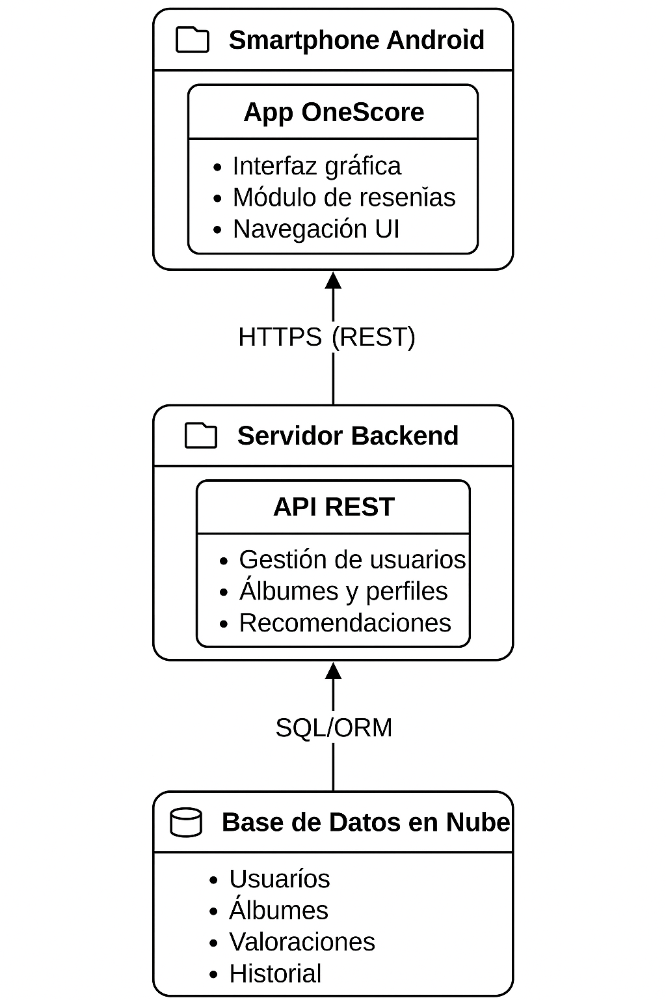

## b. Diagrama de Despligue
El siguiente diagrama de despliegue representa la arquitectura física y lógica del sistema *OneScore*, considerando sus requerimientos no funcionales clave. Esta arquitectura busca asegurar un adecuado rendimiento, escalabilidad y mantenibilidad del aplicativo móvil.

#### 🧩 Componentes principales

- **Dispositivo Móvil del Usuario**
  - Implementado con **Flutter**, permite una experiencia de usuario fluida y multiplataforma (Android/iOS).
  - Se encarga de presentar la interfaz de usuario e interactuar con el servidor mediante una API REST.
  - La comunicación con el backend se realiza de forma segura mediante el protocolo **HTTPS**.

- **Servidor Web (Backend)**
  - Desarrollado en **Ruby**, gestiona toda la lógica de negocio de la aplicación.
  - Expone una **API RESTful** para procesar solicitudes del cliente móvil, manejar autenticaciones, y gestionar datos relacionados a usuarios, álbumes, reseñas y géneros musicales.

- **Base de Datos**
  - Utiliza un sistema gestor de base de datos relacional (**PostgreSQL**).
  - Encargada de almacenar de forma estructurada la información crítica del sistema: usuarios, puntuaciones, álbumes, reseñas, géneros, relaciones y metadatos.
  - Accesible únicamente por el backend, garantizando encapsulamiento y seguridad en el manejo de datos.

#### 🔐 Relación con Requisitos No Funcionales

Este despliegue está diseñado para cumplir con los siguientes criterios no funcionales establecidos:

- **Rendimiento:** separación entre cliente y servidor para reducir la carga del dispositivo del usuario.
- **Escalabilidad:** arquitectura desacoplada que permite crecimiento futuro (e.g. balanceo de carga, despliegue en contenedores).
- **Seguridad:** uso de comunicación cifrada (HTTPS) y control de acceso desde el backend.
- **Portabilidad:** uso de Flutter como tecnología de desarrollo móvil multiplataforma.
- **Mantenibilidad:** separación clara de responsabilidades entre frontend, backend y almacenamiento, facilitando el mantenimiento y futuras extensiones.

#### 🖼️ Diagrama

  
Diagrama de despliegue