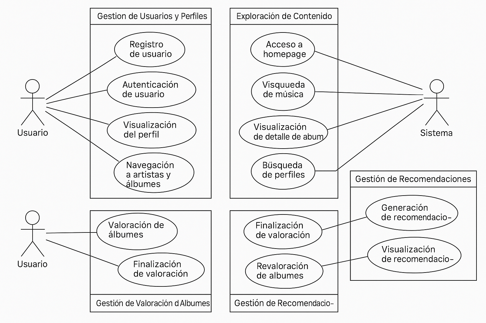

## d. Diagramas de Casos de Uso (requerimientos funcionales)

A continuación, se presentan los requerimientos funcionales del sistema **OneScore**, organizados por módulos.

---

### 🔹 Módulo 1: Gestión de Usuarios y Perfiles

| ID     | Nombre                       | Actor   | Descripción                                                                 | Precondiciones     | Resultado Esperado                                                                 |
|--------|------------------------------|---------|------------------------------------------------------------------------------|---------------------|-------------------------------------------------------------------------------------|
| RF_01 | Registro de usuario          | Usuario | Permite al usuario crear una cuenta mediante un formulario con datos personales. | No estar registrado | El usuario queda registrado correctamente y puede iniciar sesión.                 |
| RF_02 | Autenticación de usuario     | Usuario | Permite al usuario iniciar sesión con su correo/nickname y contraseña.         | Estar registrado    | El sistema autentica al usuario y lo redirige a su perfil.                        |
| RF_03 | Visualización del perfil     | Usuario | Muestra los datos personales del usuario y sus estadísticas musicales.         | Usuario autenticado | Se visualiza la información completa del perfil, álbumes y artistas.              |
| RF_04 | Visualización de artistas | Usuario | Permite al usuario visualizar a todos los artistas que escucha | Usuario autenticado | El sistema muestra todos los artistas escuchados o por escuchar, con lo opción de mostrar: todos, escuchado, por valorar  |
| RF_05 | Visualización de albums | Usuario | Permite al usuario visualizar todos los albums que escucha | Usuario autenticado | El sistema muestra todos los albums escuchados o por escuchar, con lo opción de mostrar: todos, escuchados y por valorar  |
| RF_06 | Edición del perfil| Usuario | Permite al usuario editar su perfil correo, nickname y foto. | Usuario autenticado | El sistema actualiza los nuevos del usuario usuario.                   |
| RF_07 | Cambio de contraseña | Usuario | Permite al usuario cambiar su antigua contraseña por una nueva. | Usuario autenticado | El sistema actualiza los nuevos del usuario usuario.                   |

---

### 🔹 Módulo 2: Exploración de Contenido

| ID     | Nombre                           | Actor   | Descripción                                                                                     | Precondiciones     | Resultado Esperado                                                                            |
|--------|----------------------------------|---------|--------------------------------------------------------------------------------------------------|---------------------|----------------------------------------------------------------------------------------------|
| RF_08 | Acceso a homepage                | Usuario | Muestra una pantalla con íconos de navegación a los módulos principales.                        | Usuario autenticado | El usuario puede visualizar e interactuar con los 4 accesos principales.                     |
| RF_09 | Búsqueda de música               | Usuario | Permite buscar álbumes y artistas mediante texto, filtros de género y ordenamiento.             | Usuario autenticado | Se muestran los resultados filtrados según la consulta.                                      |
| RF_10 | Visualización  de álbum| Usuario | Al seleccionar un álbum, se despliega su información completa y opción de añadirlo.             | Álbum listado       | Se muestra correctamente la vista detallada del álbum.                                       |
| RF_11 | Agregado de album al perfil | Usuario | Al clicker el botón "añadir" en la visualización del álbum, se agrega al perfil y el botón cambia de color           | Álbum seleccionado       | Se agrega el album al perfil del usuario y se marco con estado "por valorar".     
| RF_12 | Búsqueda de perfiles             | Usuario | Permite buscar otros perfiles de usuario.                                                       | Usuario autenticado | Se listan los perfiles encontrados y se puede acceder a su vista.                            |
| RF_13 | Visualización de perfil ajeno    | Usuario | Muestra el perfil de otro usuario con la misma estructura que el propio.                        | Usuario autenticado | El sistema carga correctamente el perfil del usuario buscado.                                |

---

### 🔹 Módulo 3: Valoración de Álbumes

| ID     | Nombre                   | Actor   | Descripción                                                                           | Precondiciones             | Resultado Esperado                                                           |
|--------|--------------------------|---------|----------------------------------------------------------------------------------------|-----------------------------|-------------------------------------------------------------------------------|
| RF_14 | Valoración de álbumes    | Usuario | Permite asignar una puntuación individual a cada track de un álbum.                   | Álbum en biblioteca personal | El sistema almacena la puntuación de cada track correctamente.              |
| RF_15 | Finalización de valoración| Usuario | Marca el álbum como valorado cuando todos los tracks han sido evaluados.             | Todos los tracks evaluados   | El estado cambia a “valorado” y se guarda la fecha de escucha.              |
| RF_16 | Revaloración de álbumes  | Usuario | Permite modificar la puntuación de tracks de álbumes ya valorados.                   | Álbum previamente valorado   | Se actualiza la puntuación de los tracks sin cambiar la fecha de escucha.   |
| RF_17 | Eliminación de álbumes  | Usuario | Permite eliminar el album del perfil del usuario.                   | Álbum previamente añadido   | Se elimina el album del perfil del usuario.  |

---

### 🔹 Módulo 4: Gestión de Recomendaciones

| ID     | Nombre                        | Actor   | Descripción                                                                 | Precondiciones              | Resultado Esperado                                                           |
|--------|-------------------------------|---------|------------------------------------------------------------------------------|------------------------------|-------------------------------------------------------------------------------|
| RF_18 | Generación de recomendaciones | Sistema | Analiza hábitos musicales del usuario para mostrar sugerencias personalizadas. | Usuario con historial        | Se muestra un resumen con artista recomendado y 3 álbumes similares.         |
| RF_19 | Visualización de recomendaciones | Usuario | Permite acceder a un resumen con recomendaciones desde la homepage.           | Usuario autenticado          | Se visualizan sugerencias personalizadas en la sección correspondiente.      |

## 🎲 Diagramas de Casos de Uso
El diagrama de casos de uso del sistema **OneScore** representa de forma visual las principales interacciones entre los **actores** (Usuario y Sistema) y las **funcionalidades clave** del sistema, organizadas en los siguientes módulos:

### 🔹 Gestión de Usuarios y Perfiles
Incluye funcionalidades como:
- Registro de usuario.
- Autenticación de usuario.
- Visualización del perfil.
- Navegación hacia artistas y álbumes.

### 🔹 Exploración de Contenido
Permite al usuario:
- Acceder a la pantalla principal (homepage).
- Buscar álbumes y artistas mediante texto y filtros.
- Visualizar información detallada de un álbum.
- Buscar y explorar perfiles de otros usuarios.

### 🔹 Gestión de Valoración de Álbumes
Proporciona herramientas para:
- Asignar una puntuación a cada track de un álbum.
- Finalizar la valoración cuando todos los tracks estén evaluados.
- Modificar valoraciones previas.

### 🔹 Gestión de Recomendaciones
Incorpora funcionalidades automáticas para:
- Generar recomendaciones musicales a partir del historial del usuario.
- Visualizar sugerencias personalizadas desde la homepage.

Cada **caso de uso** se representa con una elipse, mientras que los **actores** se muestran con figuras tipo "stick figure". Las líneas indican las interacciones entre los actores y las funcionalidades.

Este diagrama es fundamental para comprender los requerimientos funcionales del sistema y guía el diseño posterior de su arquitectura e implementación.

