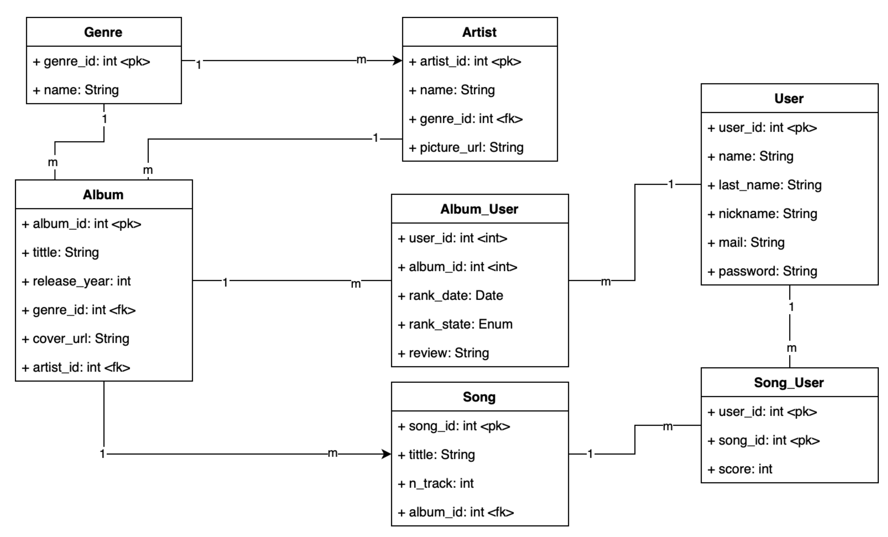

# OneScore — Grupo 01
OneScore es un aplicativo movil diseñado para los amantes de la música, críticos y artistas emergentes. Su objetivo es proporcionar un ecosistema dinámico donde los usuarios puedan descubrir nueva música, gestionar sus perfiles, calificar y reseñar álbumes, y recibir recomendaciones personalizadas basadas en sus gustos. Así como visualizar los perfiles de otros usuarios. OneScore busca crear una experiencia inmersiva y participativa para explorar y valorar el universo musical.

### Team Deveolper:
- De los Ríos Rojas, Rdorigo Francisco
- Camayo Ramos, Sebastián Enrique
- La Torre Llusera, Oscar Joaquin
- Cuella Contrerras, Luis Angel

### Diagrama de clases:

Diagrama de clases de OneScore