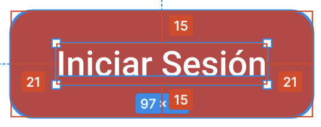
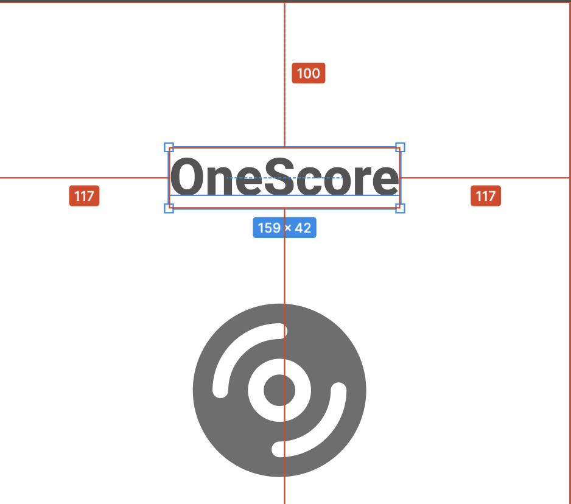
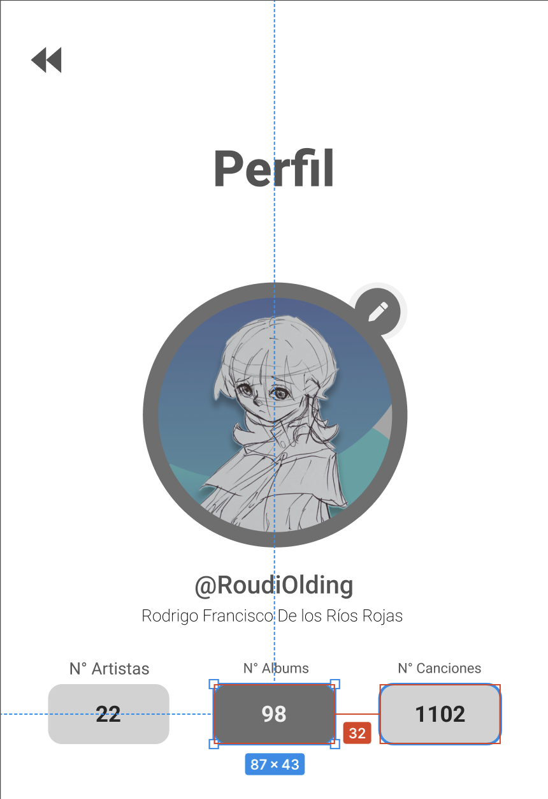

## Espaciados (generales)
- Los títulos tienen 100px de espacio
- El menubar tiene 60px con el contenido superior
- Los laterales deben dejarse vacíos con un 35px

## Fuentes (generales)
- Roboto
- Títulos: 36px — extra bold
- Sub títulos: 18px — semi bold
- Tabs: 14px — medium
- Párrafos—v1: 12px — extralight
- Párrafos—v2: 12px — regular

## Otras medidas (generales & recomendaciones)
- Debes cumplir las medidas exactas que ves en el Figma, para ello solo selecciona el elemento y manten presionado "ALT" en windows u "option" en MacOS". Verás algo como lo siguiente:

- Lo mismo harás con todos los elementos:

- Y ese es el proceso general que seguirás, respeta las medidas de todos los componentes y páginas que te toquen.
